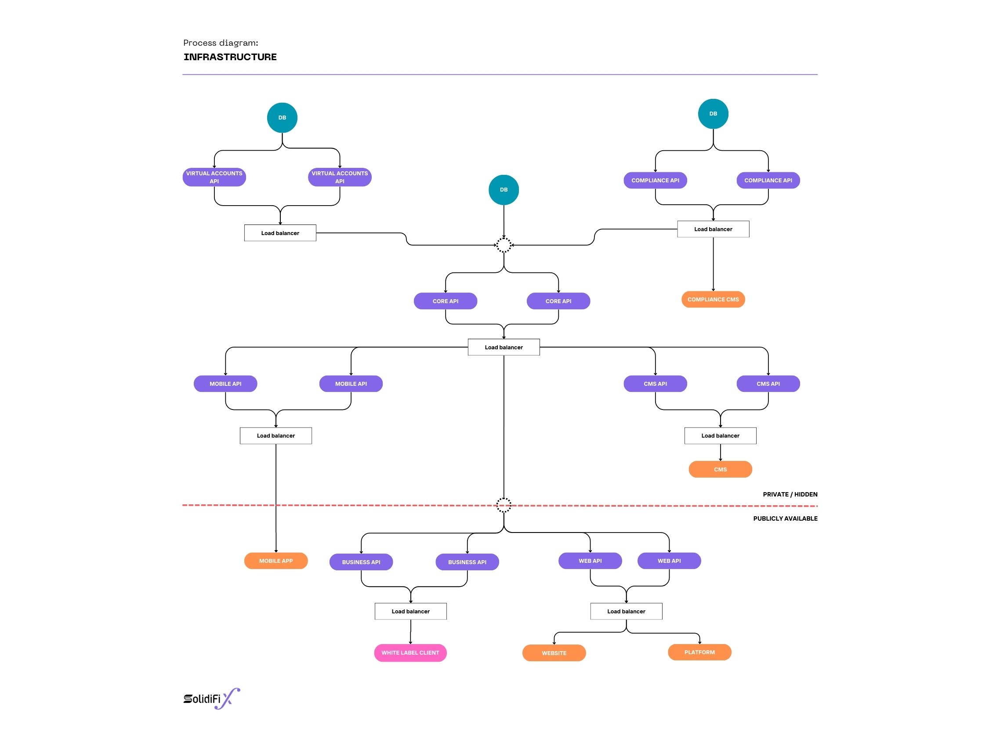
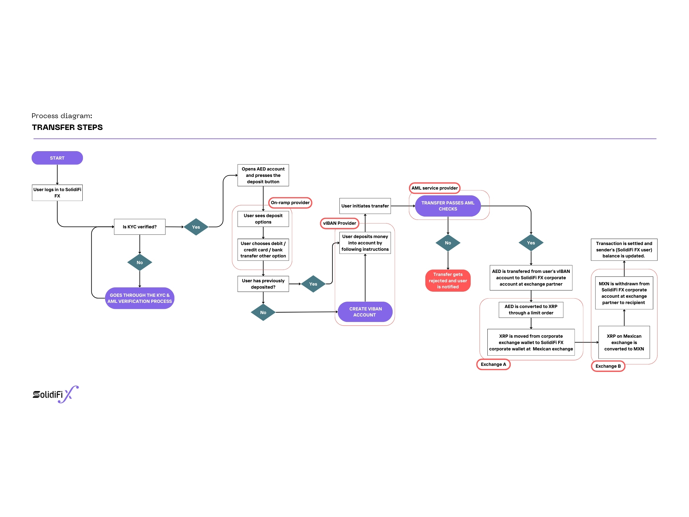
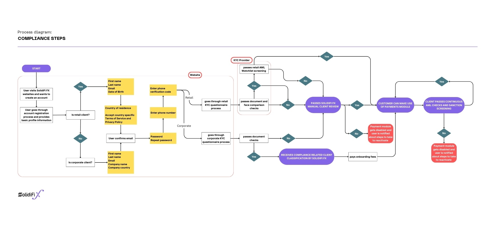

# SolidiFi FX Architecture

Revolutionary blockchain-powered cross-border payment solution leveraging XRP Ledger for instant, secure, and cost-effective international transactions.

## System Architecture

### IT Infrastructure

Multi-layered architecture with database management, API services, compliance systems, and load balancing across public and private cloud environments. Features redundant database configurations and comprehensive API integrations for virtual accounts, core services, compliance, and CMS management.

### Cross-Border Payment Flow

End-to-end payment process utilizing XRP as bridge currency. Includes KYC verification, AML checks, virtual IBAN management, and dual exchange mechanisms. Supports both corporate and retail transfers with real-time settlement through XRP Ledger integration.

### Compliance Framework

Comprehensive regulatory compliance workflow incorporating KYC verification, AML screening, and continuous monitoring. Features integration with Onfido for identity verification and Conformity Compliance Solutions for regulatory adherence in DIFC jurisdiction.

## Core Features

- **Instant Settlement**: 3-5 second transaction completion via XRPL
- **Low Cost**: Minimal fees (~0.000001 AED per transaction)
- **Regulatory Compliant**: DFSA-regulated with full AML/KYC protocols
- **Multi-Currency Support**: Seamless fiat-to-fiat conversions
- **Scalable Infrastructure**: Load-balanced architecture supporting high transaction volumes

## Technology Stack

- **Blockchain**: XRP Ledger (exclusive integration)
- **APIs**: Virtual accounts, compliance, mobile/web applications
- **Security**: Multi-layer authentication, encrypted data storage
- **Compliance**: Real-time AML monitoring, automated KYC processing